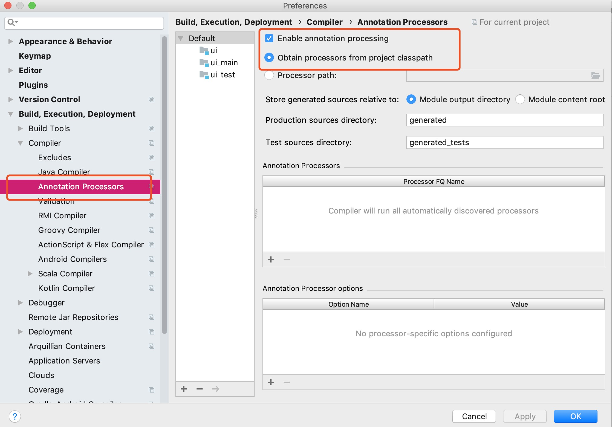
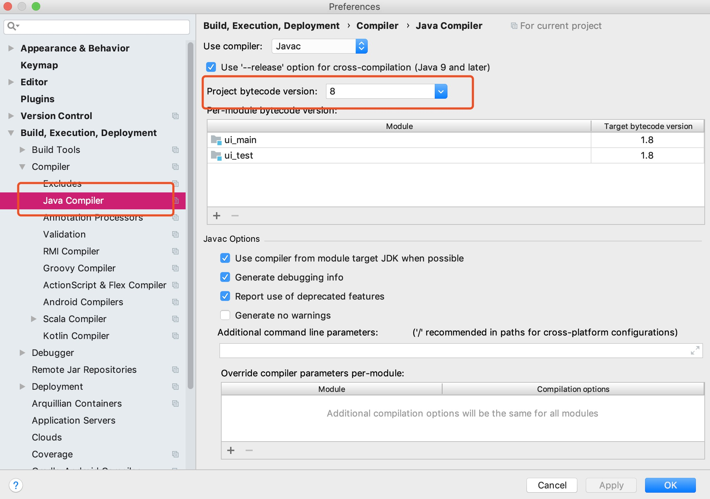

# READ ME

## Add Liquibase

1. Add Dependencies

        dependencies {
            liquibaseRuntime "mysql:mysql-connector-java"
            liquibaseRuntime "org.liquibase:liquibase-core"
            liquibaseRuntime "org.liquibase.ext:liquibase-hibernate5:${liquibase_hibernate5_version}"
            liquibaseRuntime sourceSets.main.compileClasspath
        }

## Add MapStruct

1. Add Dependencies

        dependencies {
            implementation "org.mapstruct:mapstruct-jdk8:${mapstruct_version}"
            annotationProcessor "org.mapstruct:mapstruct-processor:${mapstruct_version}"
        }
        
2. Code

    2.1 Create Common Interface

        public interface EntityManpper <D, E> {
                                       
            E toEntity(D dto);
        
            D toDto(E entity);
        
            List<E> toEntity(List<D> dtoList);
        
            List<D> toDto(List<E> entityList);
        }
        
    2.2 Extends Common Interface
    
        @Mapper(componentModel = "spring",uses = {})
        public interface ExampleMapper extends EntityMapper<ExampleDTO, ExampleEntity> {
        
            default ExampleEntity fromId(Long id) {
                if (id == null) {
                    return null;
                }
                ExampleEntity example = new ExampleEntity();
                example.setId(id);
                return example;
            }
        }
        
    2.3 Inject ExampleMapper can use `toDto` and so on. 
    
## Add Lombok

1. Add Dependencies

        dependencies {
            implementation "org.projectlombok:lombok:${lombok_version}"
        }              

2. Install Lombok Plugins

    Open IDEA `Preferences` Plugins,search `lombok` install it.
    
3. Open Settings
    
    
    
    
    
## Add Proto、GRPC

1. Add Dependencies

        buildscript {
            repositories {
                mavenLocal()
                mavenCentral()
                maven { url "http://repo.spring.io/plugins-release" }
                maven { url "https://plugins.gradle.org/m2/" }
            }
            dependencies {
                classpath "org.springframework.boot:spring-boot-gradle-plugin:${spring_boot_version}"
                classpath 'com.google.protobuf:protobuf-gradle-plugin:0.8.8'
            }
        }
        
        plugins {
            id "com.google.protobuf" version "0.8.8"      
        }

        apply plugin: 'org.springframework.boot'
        apply plugin: 'io.spring.dependency-management'
        
        dependencies {
            
            implementation 'net.devh:grpc-server-spring-boot-starter:2.0.1.RELEASE'
            implementation "io.protostuff:protostuff-core:${protostuff_version}"
            implementation "io.protostuff:protostuff-runtime:${protostuff_version}"
            implementation "com.github.BAData:protobuf-converter:${protobuf_converter_version}"
        
            compileOnly "io.grpc:grpc-netty:${grpc_version}"
            compileOnly "io.grpc:grpc-protobuf:${grpc_version}"
            compileOnly "io.grpc:grpc-core:${grpc_version}"
            compileOnly "io.grpc:grpc-stub:${grpc_version}"
        }    

2. Run Command

        gradle generateProto
        
   Code Position
   
        |-- build
               |-- generated
                        |-- source
                                |-- proto
                                        |-- main
                                            |
                                            |--- grpc
                                            |  
                                            |--- java     

3. use annotation `@net.devh.springboot.autoconfigure.grpc.server.GrpcService` to provide external service

        @GrpcService(ProtoBufferClass.class)
        public ProtoClassService extends ProtoBufferClass.ProtoClassImplBase {
        
               /**
               *  MessageClass <--> JavaDomainClass
               *
               * @Override Method (Proto File Define Method)
               */
               public void methodName (MessageClass.MessageRequest request, StreamObserver<MessageClass.MessageResponse> responseObserver) {
               
               
                    responseObserver.onNext(messageResponse);
                    responseObserver.onCompleted();
               }        
        }      

## Add Protobuf-Converter 

1. Add dependencies

        

2. Add annotation `@ProtoClass` and `@ProtoFiled` on class and filed.
    
        
        @ProtoClass(ProtobufUser.class)
        public class User {
        
        	@ProtoField
        	private String name;
        	@ProtoField
        	private String password;
        
        	// getters and setters for 'name' and 'password' fields
        	...
        }
        
        // Code for conversion User instance into related protobuf message:
        User userDomain = new User();
        ...
        ProtobufUser userProto = Converter.create().toProtobuf(ProtobufUser.class, userDomain);
        
        // Code for backward conversion:
        User userDomain = Converter.create().toDomain(User.class, userProto);

[GitHub Protobuf-Converter](https://github.com/BAData/protobuf-converter)

* Also, you can user other plugins. [GitHub Proto-Stuff](https://github.com/protostuff/protostuff)

### 数据

10个字段，包含 string、long、int、boolean、float、double

#### 90000条数据

|  统计次数| Protobuf-Converter | Code | 
| ---: | ----: | ----: |
| 1    | 1秒 324 微秒      | - |
| 2    | 1秒 362 微秒      | - |
| 3    | 1秒 347 微秒      | - |
| 4    | 1秒 455 微秒      | - |
| 5    | 1秒 315 微秒      | - |
| 6    | 1秒 347 微秒      | - |
| 7    | 1秒 398 微秒      | - |
| 8    | 1秒 314 微秒      | - |
| 9    | 1秒 312 微秒      | - |
| 10   | 1秒 308 微秒      | - |
| 平均  | 1秒 315 微秒      | received message larger than max     |

* 使用普通方法，4万条数据可以传输，9万条数据(8922432 vs. 4194304)
* 使用 Protobuf-Converter 数据到达 10W条，数据传输超出限制。(4361266 vs. 4194304)    

#### 20000 条数据

|  统计次数| Protobuf-Converter | Code |
| ---: | ----: | ----: | 
| 1    | 0秒 301 微秒      | 0秒 9 微秒 |
| 2    | 0秒 313 微秒      | 0秒 9 微秒     |
| 3    | 0秒 335 微秒      | 0秒 7 微秒     |
| 4    | 0秒 302 微秒      | 0秒 5 微秒     |
| 5    | 0秒 299 微秒      | 0秒 3 微秒     |
| 6    | 0秒 307 微秒      | 0秒 2 微秒     |
| 7    | 0秒 298 微秒      | 0秒 4 微秒     |
| 8    | 0秒 322 微秒      | 0秒 4 微秒     |
| 9    | 0秒 300 微秒      | 0秒 3 微秒     |
| 10   | 0秒 323 微秒      | 0秒 9 微秒     |
| 平均  | 0秒 310微秒      | 0秒 5.5 微秒     | 

#### 2000 条数据

|  统计次数| Protobuf-Converter | Code |
| ---: | ----: | ----: | 
| 1    | 0秒 55 微秒      | 0秒 1 微秒 |
| 2    | 0秒 40 微秒      |0秒 2 微秒  |
| 3    | 0秒 48 微秒      |0秒 2 微秒  |
| 4    | 0秒 52 微秒      |0秒 2 微秒  |
| 5    | 0秒 36 微秒      |0秒 1 微秒  |
| 6    | 0秒 37 微秒      |0秒 1 微秒  |
| 7    | 0秒 34 微秒      |0秒 2 微秒  |
| 8    | 0秒 38 微秒      |0秒 1 微秒  |
| 9    | 0秒 47 微秒      |0秒 2 微秒  |
| 10   | 0秒 33 微秒      |0秒 1 微秒  |
| 平均  | 0秒 42 微秒      | 0秒 1.5 微秒|

#### 200 条数据

|  统计次数| Protobuf-Converter | Code |
| ---: | ----: | ----: | 
| 1    | 0秒 4 微秒     | 0秒 1 微秒 |
| 2    | 0秒 3 微秒     | 0秒 1 微秒 |
| 3    | 0秒 5 微秒     | 0秒 0 微秒 |
| 4    | 0秒 5 微秒     | 0秒 1 微秒 |
| 5    | 0秒 4 微秒     | 0秒 1 微秒 |
| 6    | 0秒 3 微秒     | 0秒 1 微秒 |
| 7    | 0秒 5 微秒     | 0秒 0 微秒 |
| 8    | 0秒 4 微秒     | 0秒 1 微秒 |
| 9    | 0秒 4 微秒     | 0秒 0 微秒 |
| 10   | 0秒 4 微秒     | 0秒 1 微秒 |
| 平均  | 0秒 4.1 微秒   | 0秒 0.7 微秒 |

#### 20 条数据

|  统计次数| Protobuf-Converter | Code |
| ---: | ----: | ----: | 
| 1    | 0秒 2 微秒      | 0秒 1 微秒 |
| 2    | 0秒 2 微秒      | 0秒 1 微秒 |
| 3    | 0秒 2 微秒      | 0秒 0 微秒 |
| 4    | 0秒 2 微秒      | 0秒 1 微秒 |
| 5    | 0秒 2 微秒      | 0秒 1 微秒 |
| 6    | 0秒 2 微秒      | 0秒 1 微秒 |
| 7    | 0秒 1 微秒      | 0秒 0 微秒 |
| 8    | 0秒 1 微秒      | 0秒 1 微秒 |
| 9    | 0秒 2 微秒      | 0秒 0 微秒 |
| 10   | 0秒 1 微秒      | 0秒 1 微秒 |
| 平均  | 0秒 1.7 微秒    | 0秒 0.7 微秒 |

## Add Liquibase
